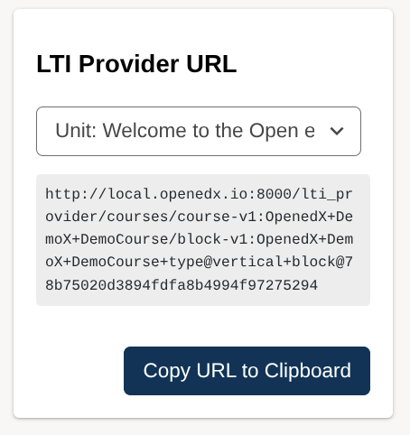
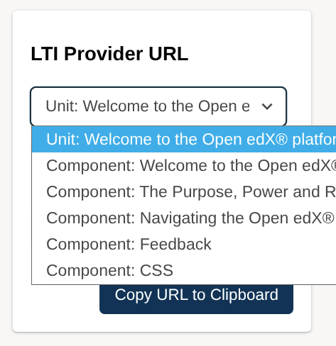

# frontend-plugins-lti-provider

LTI Provider widget for displaying and copying LTI provider URLs in Open edX.

## Widgets provided by the Plugin

### AuthoringUnitPageSidebarWidget

Displays LTI Provider URLs for the unit and its components in the sidebar of the Unit page in Studio.

## Screenshots

| Authoring unit page sidebar widget | Dropdown view of available URLs|
| --- | --- |
|  |  |

## Usage

To use the widgets from this plugin in your instance, create a Tutor plugin with the following contents:

```python
from tutormfe.hooks import PLUGIN_SLOTS
from tutor import hooks

hooks.Filters.ENV_PATCHES.add_item(
    (
        "mfe-dockerfile-post-npm-install-authoring",
        """
# Install the LTI Provider frontend plugin package
RUN npm install @tecoholic/frontend-plugin-lti-provider
""",
    )
)

hooks.Filters.ENV_PATCHES.add_item(
    (
        "mfe-env-config-buildtime-imports",
        """
import { AuthoringUnitPageSidebarWidget } from '@tecoholic/frontend-plugin-lti-provider';
""",
    )
)

PLUGIN_SLOTS.add_items(
    [
        (
            "authoring",
            "org.openedx.frontend.authoring.course_unit_sidebar.v2",
            """
            {
              op: PLUGIN_OPERATIONS.Insert,
              widget: {
                priority: 60,
                id: 'lti-provider-widget',
                type: DIRECT_PLUGIN,
                RenderWidget: AuthoringUnitPageSidebarWidget
              }
            }""",
        ),
    ]
)
```

## Development

1. In this repo: `npm install` and `npm run watch`.
2. In the host app do `npm install ../frontend-plugin-lti-provider` (assuming they are present side-by-side in the same parent directory)
3. In the host app bundler config, ensure symlinked deps resolve from the app:
   - Add `symlinks: false` to the `resolve` object in `webpack.dev.config.js`.
4. Create a `env.config.jsx` in the host app with the following contents:

    ```jsx
    import { DIRECT_PLUGIN, PLUGIN_OPERATIONS  } from '@openedx/frontend-plugin-framework';
    import { AuthoringUnitPageSidebarWidget } from '@tecoholic/frontend-plugin-lti-provider';
    const config = {
      pluginSlots: {
        'org.openedx.frontend.authoring.course_unit_sidebar.v2': {
          keepDefault: true,
          plugins: [
            {
              op: PLUGIN_OPERATIONS.Insert,
              widget: {
                priority: 60,
                id: 'lti-provider-widget',
                type: DIRECT_PLUGIN,
                RenderWidget: AuthoringUnitPageSidebarWidget
              }
            }
          ]
        }
      }
    }
    
    export default config;
    ```

## License

AGPL-3.0
